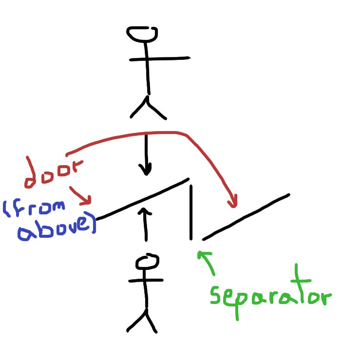

obvious push/pull door is obvious
=================================

* I feel like a stupid pushing a door with a pull sign or viceversa
* I hate doors that don't say if push or pull or are counter intuitive
* I don't know all languages that well to translate the word before hiting the door with my face

so I thought about a solution, self descriptive actions

the idea is that the door instead of being in a 90 degree angle respective to
our walking direction, it's in a small angle towards the direction "it wants to
go", so if it's "a little bit open in my direction" it means pull and viceversa.

a small divisor made of any material you like will avoid air flowing and that's
all.

