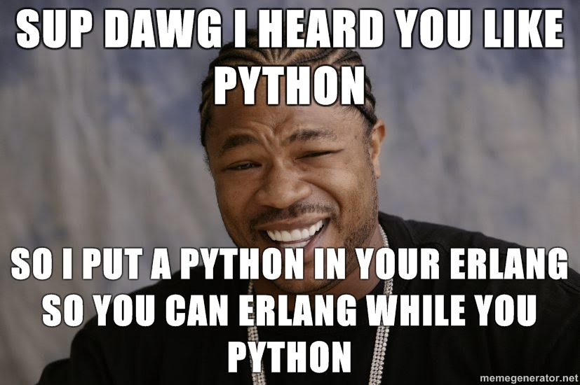

embebiendo python en cosas
--------------------------

ejemplo basico
--------------

::

        #include <Python.h>

        int main(int argc, char *argv[]) {
          Py_Initialize();
          PyRun_SimpleString("from time import time,ctime\n"
                             "print('Today is', ctime(time()))\n");
          Py_Finalize();
          return 0;
        }

compilando
----------

::

        gcc one.c -I/usr/include/python3.1/ -D_THREAD_SAFE -lpthread -ldl  -lutil -lpython3.1 -lm  -o one

programacion furiosa aca
------------------------

resultado: correr python en erlang
----------------------------------

.. code-block:: erlang

        1> pynerl:eval("t = 1", "t").
        1
        2> pynerl:eval("t = 1 * 2", "t").
        2
        3> pynerl:eval("import time;t = time.time()", "t").           
        1274236802.877999
        4> pynerl:eval("import random;t = random.random()", "t").        
        0.45102117275294684
        5> pynerl:eval("t = print('hello erlang or python')", "t").                                
        hello erlang or python
                             none
        6> pynerl:call("time", "time", []).                       
        1274236859.510859
        7> pynerl:call("random", "random", []).
        0.9623136682858975
        8> pynerl:eval("t = True", "t").                          
        true
        9> pynerl:eval("t = 2.3", "t").
        2.3

::

        wc -l pynerl.c
        247 pynerl.c

autobombo descarado
-------------------

 * http://www.erlang-ar.com.ar/
 * http://github.com/marianoguerra/efene
 * http://marianoguerra.com.ar/efene/

mas informacion
---------------

 * http://github.com/marianoguerra/pynerl
 * http://marianoguerra.blogspot.com/2010/05/embebiendo-python-en-otra-aplicacion.html
 * http://marianoguerra.blogspot.com/2010/05/evaluando-python-desde-erlang.html
 * http://marianoguerra.blogspot.com/2010/05/pynerl.html

